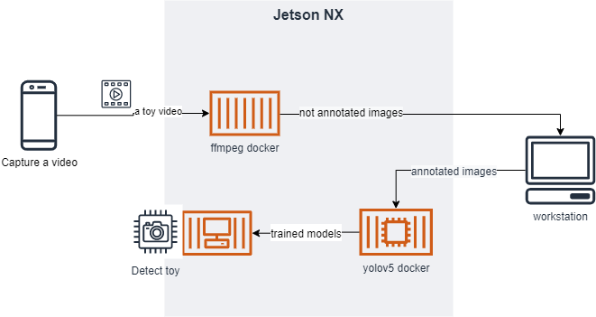

# Toy Locator

## PoC 
PoC was done on week 9 (Oct. 24th) with the following simplificiation. 
1. Take video of 5 toys (mobile phone)
2. Convert to images ([ffmpeg\(https://ffmpeg.org/) )
3. Label the images ([labelImg](https://github.com/tzutalin/labelImg))
4. Augment the images (Roboflow)
5. Split train/valid/test dataset (Roboflow)
6. Train the custom object detection model (Colab)
7. Run inference on test dataset (Colab and NX)

## overall architecture / flow 

#### (Toy Registration) creating (additional) dataset
- ***input***: video
- ***output***: datasets for a single object
- simplification: mobile phone -> nx camera -> raw input video file
- Convert to images ([ffmpeg\(https://ffmpeg.org/) )
- Label the images ([labelImg](https://github.com/tzutalin/labelImg))
- combine data with existing data 
(todo) explore the following options 
- classes.txt: automatically 
- option 1. convert to dataset without labeling. yolov5 dummy label that mark whole part of image as label
- option 2. segmentation, automatically label. (potentially publishable)  
(todo) further research on automatic labelling
(todo) replace roboflow usages 
- augment images using [image_augmentor](https://github.com/codebox/image_augmentor)
- for augmentation, splitting dataset and data.yaml creation
(idea) add guideline to camera view  

#### Training the model 
(todo) train on nx taeil has OOM, chenlin has syntax error, hongsuk has catch up to do. 
(todo) can we train incrementally? 
- input: dataset 
- output: model 
- (todo): test option 1 of dataset creation how well it performs without labeling 
1. Pre-trained model (imagenet, yolov5, googlenet)
2. train model and test 
 
#### Inteferece 
- simplification: live video -> image of scene 
- testing prep: manually label objects from scenes
- input: image of scene, object name (e.g., blue spiderman)
- output: rectangular on the image
(todo) detect source camera (for fun)
(todo) test more with different test images (rooms)

#### Broker / cloud 
- (depends on the possibility of incremental training)
- training happens in the central place where all the training dataset is kept. 

## Phase 1 
#### Training (transfer learning or embedding) on mobile phone or NX or Raspberry Pi
1. Pre-trained model (imagenet, yolov5, googlenet) 
2. Load them 
3. Capturing video 
4. Augment to increase training set 
5. Create training set (separate out test set) 

## Problem 

> Leo (4 years old): Mommy, have you seen my spiderman?
>
> Mom: No. I saw it yesterday from the bathroom. 
>
> (after 10 mins) 
>
> Dad: Honey, have you seen my key?
>
> Mom: You ask everyday. Can you put it next to the door where it should be? 
>
> Dad: That is not the answer I was looking for. 
>
> (silence) 

2 years Later

> Leo (6 years old): Hey toy locator, where is the blue Ironman. 
>
> Toy Locator: The blue Ironman is at bedroom number 2 right below the red chair on the left side of the room.
>
> Leo: Thanks Toy Locator. 
>
> Toy Locator: You are welcome. 
