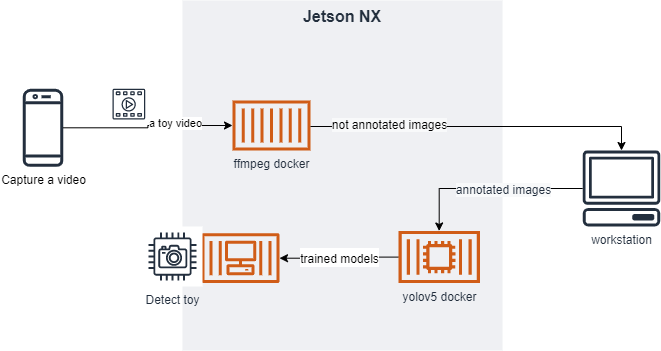
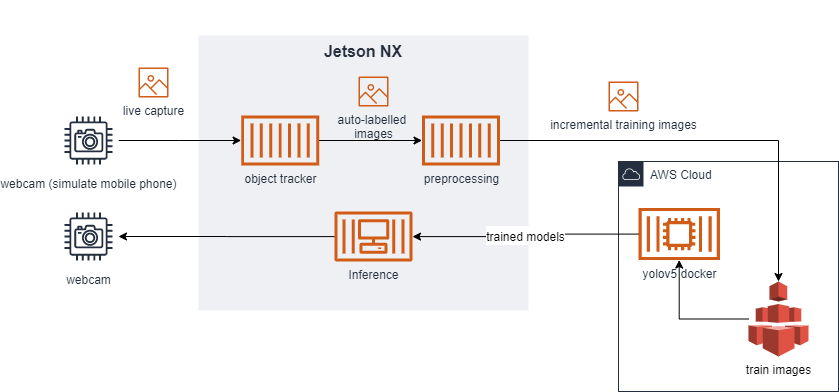

Toy Locator
==============================

Deep Learning application to locate a toy at a household


## overall architecture / flow 
1. Collect: images from camera 
2. Label: automaticallly with the minimum input by the user (select area at the beginning and enter the name)
4. Process: 
5. Train: 
6. Deploy: Download the model on the device and detect the object real time
7. Display
	1. Show on the screen the location of the specific object 
	2. Announce the location of the toy

#### Training on an Edge Device With Manual Labeling


#### Training on Cloud With Auto-labelling


## (Toy Registration) creating (additional) dataset

#### 1. Collect and Label Images from camera 
- ***input***: webcam
- ***output***: labelled images 
- Using Deep SORT mechanism to track the image once labelled. 
- See more on [different approaches to annotate toys](annotation)

#### 2. Process Images
- ***input***: labelled images 
- ***output***: dataset
 augment, split dataset and creat data.yaml 
1. Resize to similar to camera 
2. Augment annotated images
	1.  augment (rotate, noise, flip, etc) images using [image_augmentor](https://github.com/codebox/image_augmentor)

#### 3. Train the model 
- ***input***: dataset
- ***output***: models (best.pt) 
1. Pre-trained model (e.g., yolov5)
2. Train model and test (determine if the model is good enough to be distributed
3. [TODO] training with single command
4. [TODO] use data from s3 bucket 

#### 4. Inference 
- simplification: live video -> image of scene 
- testing prep: manually label objects from scenes
- ***input***: image of scene, live feed from camera 
- ***input***: object name (e.g., blue dump truck)
- ***input***: trained models 
- ***output***: rectangular on the image or display
[TODO source camera] 
[TODO test more with different test images (rooms)] 

To run inference on test dataset
```
!python3 detect.py --weights toy/modeling/pretrained/best_v1024_5toys.pt --img 416 --conf 0.4 --source "toy/data/4 toys.v2.yolov5pytorch/test/images"
```

To run inference on the camera, 
```
# must run this command on NX terminal (not SSH)
xhost +

docker run --name toylocator --privileged -e DISPLAY=$DISPLAY --runtime nvidia -v $PWD/modeling/pretrained:/toy_pt -v $PWD/data:/data -v /tmp:/tmp -p 8888:8888 -p 6006:6006 -ti yolov5

# generic detection for sanity check (please change to 0)
python3 detect.py --source 1 --weights yolov5s.pt --conf 0.4

# run toy detection with camera (please change to 0)
python3 detect.py --source 1 --weights /toy_pt/best_v1026_5toys.pt --conf 0.4

```

## Problem 

> Leo (4 years old): Mommy, have you seen my spiderman?
>
> Mom: No. I saw it yesterday from the bathroom. 
>
> (after 10 mins) 
>
> Dad: Honey, have you seen my key?
>
> Mom: You ask everyday. Can you put it next to the door where it should be? 
>
> Dad: That is not the answer I was looking for. 
>
> (silence) 

2 years Later

> Leo (6 years old): Hey toy locator, where is the blue Ironman. 
>
> Toy Locator: The blue Ironman is at bedroom number 2 right below the red chair on the left side of the room.
>
> Leo: Thanks Toy Locator. 
>
> Toy Locator: You are welcome. 


#### Future Work 
- incremental training 
- googlenet

<p><small>Project based on the <a target="_blank" href="https://drivendata.github.io/cookiecutter-data-science/">cookiecutter data science project template</a>. #cookiecutterdatascience</small></p>
