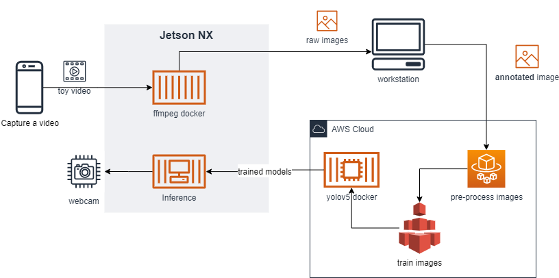

# Toy Locator

## PoC 
PoC was done on week 9 (Oct. 24th) with the following simplificiation. 
1. Take video of 5 toys (mobile phone)
2. Convert to images ([ffmpeg](https://ffmpeg.org/) )
3. Label the images ([labelImg](https://github.com/tzutalin/labelImg))
4. Augment the images (Roboflow)
5. Split train/valid/test dataset (Roboflow)
6. Train the custom object detection model (Colab)
7. Run inference on test dataset (Colab and NX)

 (source: https://roboflow.com/)

## overall architecture / flow 

#### all with Jetson Xavier NX


#### Training on Cloud


[TODO] convert to docker-compose to simply NX deployments
[TODO] automotically trigger all of the processing and download the model automatically in xx mins

## (Toy Registration) creating (additional) dataset
- ***input***: video
- ***output***: datasets for a single object
- simplification: mobile phone -> nx camera -> raw input video file

#### 1. Collect Video 
Capture a video using mobile phone
[TODO] Capture a video using a camera using NX (modifiy detect.py)
[TODO] add guideline to camera view

#### 2. Convert Images ([ffmpeg](https://ffmpeg.org/) )
Convert videos to images 
```
ffmpeg -i video/IMG_xxxx.MOV -frames:v 100 -r 2 images/toy_xxxx%03d.jpg
```

#### 3. Preparing Training Datasets
 [TODO] replace roboflow usages for augmentation, splitting dataset and creating data.yaml creation! 
1. Manually label the images using [labelImg](https://github.com/tzutalin/labelImg))
	1. label new images 
	2. [TODO] merge with existing classes.txt and update class ID
	3. [TODO] validate label and image sizes
2. Augment annotated images
	1.  [TODO] augment (rotate, noise, flip, etc) images using [image_augmentor](https://github.com/codebox/image_augmentor)

#### 3. Automatic label
Manual labelling images is not feasible options for actual real life scenario. 
Explore the following options 
- [TODO] option 1. convert to dataset without labeling. yolov5 dummy label that mark whole part of image as label
- [TODO] option 2. segmentation, automatically label. (potentially publishable)  
- [TODO] further research on automatic labelling 

#### 4. Training the model 
[TODO train on nx taeil has OOM, chenlin has syntax error, hongsuk has catch up to do.] 
[TODO can we train incrementally?] 
- ***input***: dataset
- ***output***: models (best.pt) 
- [TODO test option 1 of dataset creation how well it performs without labeling] 
1. Pre-trained model ([TODO imagenet], yolov5, [TODO googlenet])
2. Train model and test 

To run yolov5 docker, 
```
# CD to toylocator repo before starting the docker

docker run -e DISPLAY=$DISPLAY --name toylocator --rm --privileged --runtime nvidia -v $PWD/modeling/pretrained:/toy_pt -v $PWD/data:/data -v /tmp:/tmp -p 8888:8888 -p 6006:6006 -ti yolov5

```

To train
```
# I removed --cache parameter in case. 

# optino 1
python3 train.py --img 416 --batch 16 --epochs 100 --data '/data/5_toys.v2.yolov5pytorch/data.yaml' --cfg /data/custom_yolov5s.yaml --weights '' --name yolov5s_results 

# option 2
python3 train.py --img 416 --batch 16 --epochs 100 --data '/data/5_toys.v2.yolov5pytorch/data.yaml' --cfg /data/custom_yolov5s.yaml --weights yolov5s.pt --cache

```


#### 5. Inference 
- simplification: live video -> image of scene 
- testing prep: manually label objects from scenes
- ***input***: image of scene, live feed from camera 
- ***input***: object name (e.g., blue dump truck)
- ***output***: rectangular on the image or display
[TODO source camera] 
[TODO test more with different test images (rooms)] 

To run inference on test dataset
```
!python3 detect.py --weights toy/modeling/pretrained/best_v1024_5toys.pt --img 416 --conf 0.4 --source "toy/data/4 toys.v2.yolov5pytorch/test/images"
```

To run inference on the camera, 
```
# must run this command on NX terminal (not SSH)
xhost +

docker run --name toylocator --privileged -e DISPLAY=$DISPLAY --runtime nvidia -v $PWD/modeling/pretrained:/toy_pt -v $PWD/data:/data -v /tmp:/tmp -p 8888:8888 -p 6006:6006 -ti yolov5

# generic detection for sanity check (please change to 0)
python3 detect.py --source 1 --weights yolov5s.pt --conf 0.4

# run toy detection with camera (please change to 0)
python3 detect.py --source 1 --weights /toy_pt/best_v1026_5toys.pt --conf 0.4

```

#### 6. Broker / cloud 
- (depends on the possibility of incremental training)
- training happens in the central place where all the training dataset is kept. 


## Problem 

> Leo (4 years old): Mommy, have you seen my spiderman?
>
> Mom: No. I saw it yesterday from the bathroom. 
>
> (after 10 mins) 
>
> Dad: Honey, have you seen my key?
>
> Mom: You ask everyday. Can you put it next to the door where it should be? 
>
> Dad: That is not the answer I was looking for. 
>
> (silence) 

2 years Later

> Leo (6 years old): Hey toy locator, where is the blue Ironman. 
>
> Toy Locator: The blue Ironman is at bedroom number 2 right below the red chair on the left side of the room.
>
> Leo: Thanks Toy Locator. 
>
> Toy Locator: You are welcome. 
