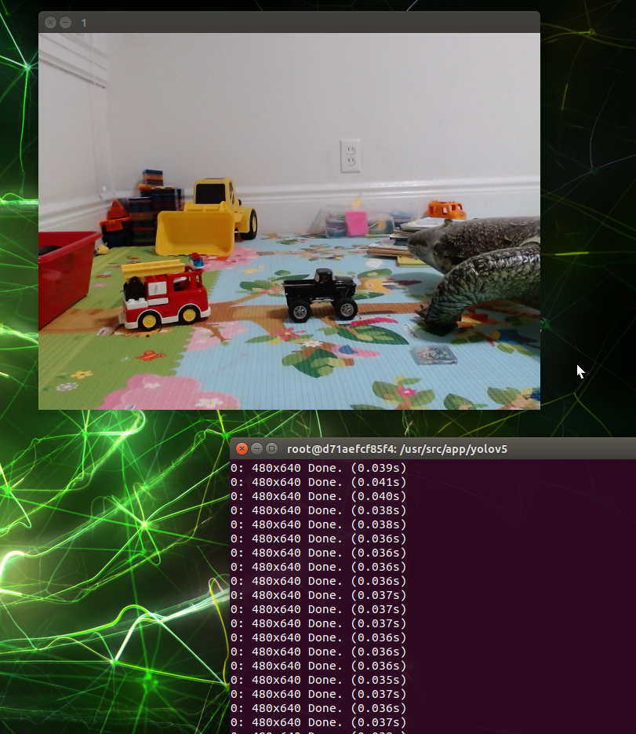

# v1024 Test Result

5 toys, 3xx images

#### Test result during the training
![[tensorboard.png]]

![[plot.png]]

#### But Initial Results In Real Life Testing 
Not detecting... 

If I put the toy really closer to the camera, sometimes it detects with low confidence
![[close_to_camera.png]]

#### Next
- [TODO] Test with more static images instead of camera feed
- [TODO] More augmentation and more taining images 