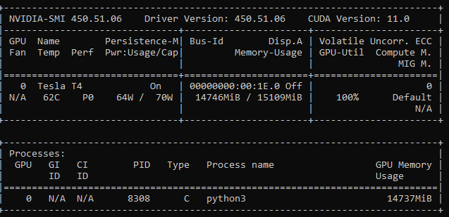

# Training On AWS

#### System Requirements 
- file storag: s3, EFS, or aws s3 copy  
	- EFS cannot be mounted on NX (does it matter?)
	- can s3 mounted everywhere? (s3fs)
- Instance type
	- p3.2xlarge
	- ***g4dn.2xlarge***
	
- AMI used (either one is good)
	- ***Nvidia Deep Learning AMI***:  `ami-0384cb16509f0e03b`
	- AWS Deep Learning AMI
- firewall rules (22 AND 8888)
- Yolov5 docker 
	- [Dockerfile](Dockerfile.cloud.yolov5) based on [Yolov5-based docker](https://github.com/ultralytics/yolov5/blob/master/Dockerfile)
	- [Containers: nvidia:pytorch](https://ngc.nvidia.com/catalog/containers/nvidia:pytorch/layers)
https://github.com/ultralytics/yolov5/issues/58
	- [TODO] fix warning 
NOTE: MOFED driver for multi-node communication was not detected.
      Multi-node communication performance may be reduced.
	- [TODO] --runttime nvidia vs --gpus all

#### Training with high resolution images 
- For the rectangles 1080x1920, [--img-size 1920 --rect](https://github.com/ultralytics/yolov5/issues/700) => validation shows good results but not with the production inference. 
- It took longer to train the model

#### Start Instance and Docker
Start AWS deep learning image instance 
- specify `--instance-type`: `p3.2xlarge` or `g4dn.2xlarge` 
- (optional) `--instance-market-options` for spot instance. 
```
aws ec2 run-instances --image-id <AMI ID> --instance-type <either p3 or g4 instance> --associate-public-ip-address --key-name <key name> 
--instance-market-options file://spot-options.json 
```

Using Docker-Compose  
- [install awscli](https://docs.aws.amazon.com/cli/latest/userguide/install-cliv2-linux.html#cliv2-linux-install)
```
# install awscli if missing 
# sudo apt install -y awscli 
aws configure
# enter access key and secret key for s3://toylocator 

# CD to toylocator repo before starting the docker
git clone https://github.com/toylocator/toylocator.git
cd toylocator 
```

Using Docker-Compose (stable run only)
- [install docker-compose](https://docs.docker.com/compose/install/) 
```
# sudo curl -L "https://github.com/docker/compose/releases/download/1.27.4/docker-compose-$(uname -s)-$(uname -m)" > ~/docker-compose
# chmod +x ~/docker-compose 
# sudo mv ~/docker-compose /usr/local/bin/docker-compose

cd ~/toylocator/model

# use the following command only if needs to rebuild with fresh docker image 
# docker-compose build --no-cache
docker-compose up
```

Using Docker (debugging purpose) 
```
docker build -t toytrainer -f Dockerfile.cloud.yolov5 . --no-cache

docker run --ipc=host --name toytrainer --rm --privileged --gpus all -v /tmp:/tmp -v $HOME/.aws:/root/.aws:rw -p 8888:8888 -p 6006:6006 -ti toytrainer

# Either run shell script or see the next section 
# chmod +x ../toy/train_yolov5_model.sh
# ./train_yolov5_model.sh
```
 For debugging, see [train_yolov5_model.sh](../src/models/train_yolov5_model.sh)

Training Visualization 
- see [Weights and Biases dashboard](https://wandb.ai/taeil/YOLOv5) 
```
# if you build the docker fresh, no need the following. 
# Weights & Biases (not very successful)
# pip install -q wandb  
# wandb login e96802b17d8e833421348df053b41a538a810177
# check  /root/.netrc 

# tensorboard 
nohup tensorboard --logdir=runs & 
```


#### Other Things That Was Not Working
Using [Yolov5 docker](https://github.com/ultralytics/yolov5/wiki/Docker-Quickstart)  This does not work. Some issue maybe related to pytorch version compatibility. 
```
sudo docker pull ultralytics/yolov5:latest
sudo docker run --ipc=host --gpus all -it ultralytics/yolov5:latest
sudo docker run --ipc=host --runtime nvidia --gpus all -it ultralytics/yolov5:latest

docker run --name toylocator --rm --privileged --gpus all --runtime nvidia -v $PWD/data:/usr/src/app/data -v /tmp:/tmp -p 8888:8888 -p 6006:6006 -ti yolov5cloud

sudo docker run --ipc=host --gpus all -p 8888:8888 -p 6006:6006 -it ultralytics/yolov5:latest

```


