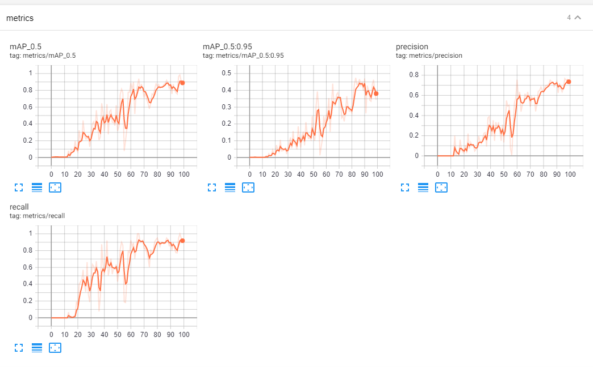
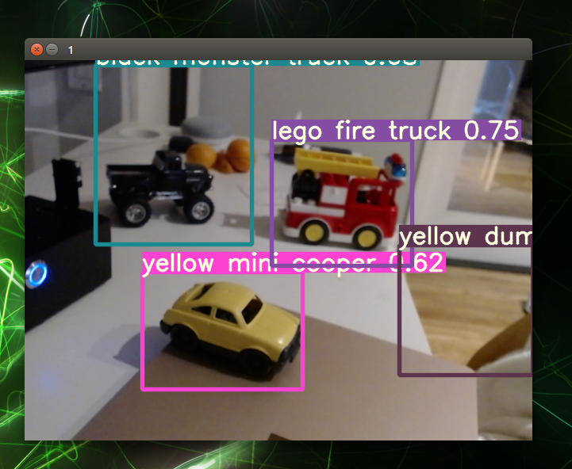

## PoC 
PoC was done on week 9 (Oct. 24th) with the following simplificiation. 
1. Take video of 5 toys (mobile phone)
2. Convert to images ([ffmpeg](https://ffmpeg.org/) )
3. Label the images ([labelImg](https://github.com/tzutalin/labelImg))
4. Augment the images (Roboflow)
5. Split train/valid/test dataset (Roboflow)
6. Train the custom object detection model (Colab)
7. Run inference on test dataset (Colab and NX)

 (source: https://roboflow.com/)

## v1026 Test Result

#### change comparing to v1024
- resize without strecthing 

#### Test result during the training

#### Initial Results In Real Life Testing 

#### Finding
- Match the dimension for camera and training images 
- labeling effort was not scalable. 
